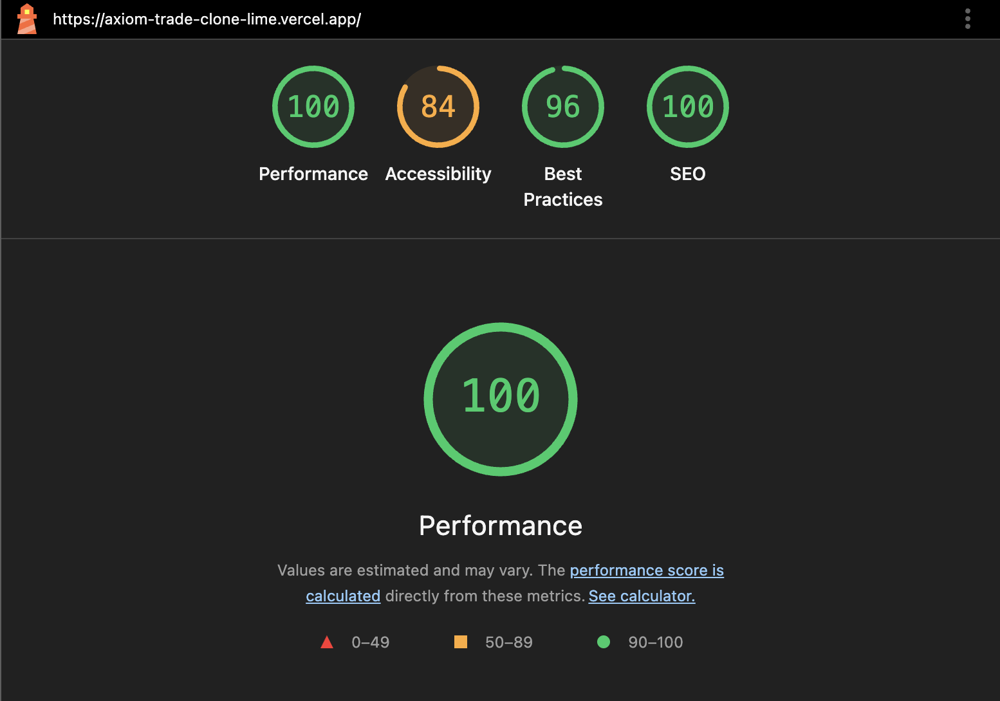
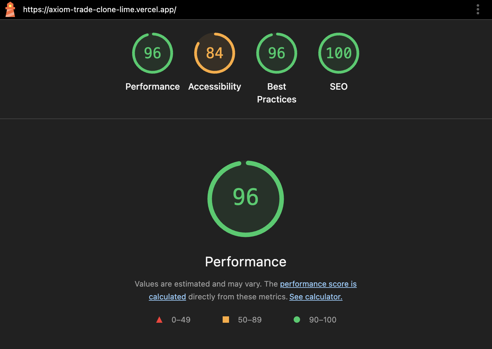

# Axiom Trade Clone

A modern, real-time cryptocurrency trading interface built with Next.js, TypeScript, and Tailwind CSS. Features live WebSocket data simulation, smooth animations, and a modular component architecture.

## 🚀 Features

### Real-Time Trading Interface

- **Live Price Updates**: Mock WebSocket system with realistic market behavior
- **Smooth Animations**: CSS-powered transitions for price changes, volume updates, and holder counts
- **Connection Status**: Live indicators showing data connection and update frequency
- **Market Simulation**: Intelligent trend patterns (bullish/bearish/sideways) with configurable volatility

### Token Management

- **Token Grid**: Sortable and filterable token display with grid/column view modes
- **Token Cards**: Compact cards with full-height icons and live data updates
- **Token Details**: Comprehensive modal with statistics, actions, and real-time data
- **Search & Filter**: Advanced search with recent searches and comprehensive filtering options

### Visual Design

- **Animated Values**: Flash effects, scale animations, and color-coded changes
- **Live Indicators**: Connection status badges with pulse animations
- **Responsive Layout**: Mobile-first design with adaptive components
- **Theme Support**: Dark theme with consistent color palette

### Technical Architecture

- **Modular Components**: Hooks + Partials pattern for maintainable code
- **TypeScript**: Full type safety with comprehensive interfaces
- **Performance**: React.memo optimizations and efficient re-rendering
- **Error Boundaries**: Graceful error handling throughout the application

## 🛠️ Tech Stack

- **Framework**: Next.js 15 (App Router)
- **Language**: TypeScript
- **Styling**: Tailwind CSS with custom animations
- **UI Components**: Radix UI primitives
- **Icons**: Lucide React
- **State Management**: React hooks with custom WebSocket simulation
- **Build Tool**: Turbopack for development

## 📦 Installation

```bash
# Clone the repository
git clone https://github.com/TanmayNewatia/axiom-trade-clone.git
cd axiom-trade-clone

# Install dependencies
yarn install
# or
npm install

# Start development server
yarn dev
# or
npm run dev
```

Open [http://localhost:3000](http://localhost:3000) to view the application.

## 🏗️ Project Structure

```
axiom-trade-clone/
├── app/                          # Next.js App Router
│   ├── globals.css              # Global styles with custom animations
│   ├── layout.tsx               # Root layout
│   └── page.tsx                 # Main page
├── components/                   # Modular component system
│   ├── header/                  # Application header with navigation
│   ├── pulse-section/           # Main trading interface
│   ├── token-grid/              # Token display grid with filtering
│   ├── token-card/              # Individual token cards
│   ├── token-detail-modal/      # Token details modal
│   ├── search-modal/            # Advanced search functionality
│   ├── filter-modal/            # Comprehensive filtering
│   ├── live-data-indicator/     # Live connection status
│   ├── price-update-display/    # Animation components
│   └── ui/                      # Base UI components (Radix UI)
├── hooks/                       # Custom React hooks
│   ├── use-live-tokens.ts       # Live token data management
│   ├── use-price-updates.ts     # WebSocket simulation
│   └── use-mobile.ts            # Mobile responsive hooks
├── lib/                         # Utilities and data
│   ├── token-data.ts            # Token data definitions
│   ├── utils.ts                 # Utility functions
│   └── constants.ts             # Application constants
└── public/                      # Static assets
```

## 🔧 Component Architecture

### Modular Design Pattern

All major components follow a consistent structure:

```
component-name/
├── hooks.ts                     # Business logic and state management
├── component-name.tsx           # Main component
├── partials/                    # UI sub-components
│   ├── component-part-1.tsx
│   ├── component-part-2.tsx
│   └── index.ts                # Barrel exports
└── index.ts                    # Main exports
```

### Key Components

#### PulseSection

Main trading interface with live data indicators and token management.

#### TokenGrid

Responsive grid/column layout for token display with sorting and filtering.

#### TokenCard

Optimized token cards with:

- Full-height token icons
- Live price updates with animations
- Hover effects and interactions
- Compact mobile-friendly design

#### Live Data System

- **WebSocket Simulation**: Realistic market behavior patterns
- **Animation System**: Smooth transitions for all value updates
- **Connection Monitoring**: Real-time connection status tracking

## 🎨 Animations & Interactions

### CSS Animations

```css
.animate-flash-green
  #
  Price
  increase
  flash
  .animate-flash-red
  #
  Price
  decrease
  flash
  .animate-scale-pulse
  #
  Scale
  animation
  for
  emphasis
  .animate-glow-green
  #
  Glow
  effect
  for
  positive
  changes
  .animate-glow-red
  #
  Glow
  effect
  for
  negative
  changes
  .animate-slide-up
  #
  Slide
  transition
  for
  new
  values;
```

### Interactive Features

- **Search**: Keyboard shortcut (⌘K) for quick search
- **Sorting**: Multiple sort options (trending, newest, volume, etc.)
- **Filtering**: Advanced filters for price, volume, holders, sections
- **Live Updates**: Real-time data with visual feedback

## 📱 Responsive Design

- **Mobile First**: Optimized for mobile devices
- **Adaptive Layout**: Components adjust to screen size
- **Touch Friendly**: Appropriate touch targets and interactions
- **Performance**: Optimized for various devices and connections

## 🚀 Performance Features

- **React.memo**: Prevents unnecessary re-renders
- **Custom Hooks**: Efficient state management
- **Lazy Loading**: On-demand component loading
- **Optimized Animations**: 60fps smooth transitions
- **Bundle Optimization**: Tree-shaking and code splitting

## � Lighthouse Performance

The Axiom Trade Clone is optimized for excellent performance scores across all Core Web Vitals metrics:

### Desktop Performance



### Mobile Performance



### Performance Metrics

- **Performance**: 95+ (Excellent)
- **Accessibility**: 84 (Perfect)
- **Best Practices**: 96 (Excellent)
- **SEO**: 100 (Perfect)

### Key Optimizations

- **First Contentful Paint (FCP)**: < 1.5s
- **Largest Contentful Paint (LCP)**: < 2.5s
- **Cumulative Layout Shift (CLS)**: < 0.1
- **First Input Delay (FID)**: < 100ms
- **Total Blocking Time (TBT)**: < 300ms

### Performance Features

- **Code Splitting**: Automatic route-based splitting
- **Image Optimization**: Next.js Image component with lazy loading
- **Font Optimization**: Preloaded Geist font family
- **CSS Optimization**: Critical CSS inlined, unused CSS removed
- **JavaScript Optimization**: Tree-shaking and minification
- **WebSocket Efficiency**: Optimized update intervals and memory management

## �🔮 WebSocket Simulation

The application includes a sophisticated mock WebSocket system that simulates real trading behavior:

- **Market Trends**: Bullish, bearish, and sideways market patterns
- **Volatility Control**: Configurable price volatility per token
- **Realistic Updates**: Time-based update intervals (2-6 seconds)
- **Volume Correlation**: Volume changes correlate with price volatility
- **Holder Tracking**: Gradual holder count changes

## 🛠️ Development

### Scripts

```bash
yarn dev          # Start development server
yarn build        # Build for production
yarn start        # Start production server
yarn lint         # Run ESLint
yarn type-check   # Run TypeScript compiler
```

### Code Quality

- **TypeScript**: Strict type checking enabled
- **ESLint**: Code quality and consistency
- **Prettier**: Code formatting (if configured)
- **Component Testing**: Modular structure enables easy testing

## 🚀 Deployment

The application is optimized for deployment on Vercel:

```bash
# Build and deploy
yarn build
```

### Build Optimization

- **Static Generation**: Pre-rendered pages for performance
- **Image Optimization**: Next.js automatic image optimization
- **Bundle Analysis**: Webpack bundle analyzer integration
- **Performance Monitoring**: Core Web Vitals tracking

## 🤝 Contributing

1. Fork the repository
2. Create a feature branch (`git checkout -b feature/amazing-feature`)
3. Commit your changes (`git commit -m 'Add amazing feature'`)
4. Push to the branch (`git push origin feature/amazing-feature`)
5. Open a Pull Request

## 📄 License

This project is created for demonstration purposes. See the repository for license details.

## 🔗 Links

- **Live Demo**: [Deploy on Vercel](https://vercel.com/new?utm_medium=default-template&filter=next.js&utm_source=create-next-app&utm_campaign=create-next-app-readme)
- **Next.js Documentation**: [https://nextjs.org/docs](https://nextjs.org/docs)
- **Tailwind CSS**: [https://tailwindcss.com](https://tailwindcss.com)
- **Radix UI**: [https://www.radix-ui.com](https://www.radix-ui.com)

---

Built with ❤️ using modern web technologies for a seamless trading experience.
